# Architecture — AiDevLoop

## Overview

AiDevLoop follows the **Functional Core, Imperative Shell** pattern with a pipeline-based architecture. Pure functions handle business logic and decision-making (core), while I/O operations live at the boundaries (shell).

**Automation Level:** The tool orchestrates LLM agents to execute steps 1-7 of the Phase 2 development loop fully autonomously. Step 8 (commit) requires mandatory user approval. User interaction only occurs when automated validation fails or the review loop exhausts its iteration limit.


---

## Architectural Pattern: Functional Core + Imperative Shell

### Core Principles

**Functional Core:**
- Pure functions — same input always produces same output
- No I/O — no file system, network, or external state
- Easy to test — no mocking required
- Contains all business logic and decision-making

**Imperative Shell:**
- Orchestrates I/O operations
- Calls core functions with loaded data
- Writes results from core back to external systems
- Handles side effects (file writes, process execution, console output)

**Benefits:**
- Testable logic without I/O complexity
- Clear separation of concerns
- Easier to reason about data flow
- Refactoring is safer and simpler

---

## LLM Automation Model

AiDevLoop orchestrates multiple LLM agent invocations to execute the Phase 2 development loop. Understanding who does what is critical:

### Execution Model

| Step | Who Executes | Automation Level | User Interaction |
|------|--------------|------------------|------------------|
| 1. Select Task | **LLM** (via core logic) | Fully automated | None |
| 2. Load Task | **LLM** (via file ops) | Fully automated | None |
| 3. Implement | **LLM** (implementation agent) | Fully automated | None |
| 4. Validate | **LLM** (via validation commands) | Fully automated | Only on failure (optional) |
| 5. Review | **LLM** (review + fix agents) | Fully automated | Only if loop exhausted (optional) |
| 6. Integration Check | **LLM** (via test commands) | Fully automated | None |
| 7. Update Docs | **LLM** (via file ops) | Fully automated | None |
| 8. Commit | **Human** | **Requires approval** | **Always required** |

### Agent Roles

1. **Implementation Agent** — Reads task spec, writes code, fills implementation-notes.md
2. **Review Agent** — Analyzes code against validation criteria, classifies issues
3. **Fix Agent** — Addresses blocking issues identified by review agent

All agents are invoked via external CLI tools (`claude` or `copilot`). The orchestrator constructs prompts from templates and context files, then executes the CLI.

### The Single Human Checkpoint

**Why step 8?** The commit step is the only mandatory human checkpoint because:
- It's the point where code enters version control
- User reviews the full diff and proposed commit message
- Provides final sanity check before code is persisted
- User can abort if LLM output is incorrect despite passing automated checks

**Failure scenarios:** Users may also interact if automated validation fails repeatedly or review iterations exhaust — but this is optional recovery, not mandatory workflow.

---

## System Architecture


---

## Component Breakdown

### Imperative Shell

#### CLI Entry Point
- **Responsibility:** Parse command-line arguments, load configuration, invoke orchestrator
- **Files:** `Program.cs`, `CommandLineParser.cs`, `ConfigurationLoader.cs`

#### Task Orchestrator
- **Responsibility:** Execute the 8-step development loop by coordinating core functions and I/O adapters. Orchestrates LLM agent invocations for steps 1-7, then pauses for mandatory user approval at step 8.
- **Files:** `TaskOrchestrator.cs`
- **Key Operations:**
  - Load task data via FileOps
  - Pass to core functions for decisions
  - Invoke LLM agents (implementation, review, fix) via ILLMClient
  - Execute results via I/O adapters
  - Handle user prompts (failures only, plus mandatory commit approval)

#### I/O Adapters
- **FileOperations:** Read/write files atomically, create directories, initialize default prompt templates from embedded resources
- **ProcessRunner:** Execute external commands (lint, test, build), capture stdout/stderr
- **LLMClient:** Invoke LLM agents via CLI tools (claude, copilot), construct prompts with pre-loaded context
- **GitClient:** Stage all changes, commit with message, check repository status
- **ConsoleIO:** Display output with mode awareness (normal/verbose/quiet), prompt user for decisions

**Context File Management:**
- Orchestrator creates `context/current-task.md` by copying task block from plan (step 2)
- Orchestrator creates empty `context/implementation-notes.md` template with section headings before invoking implementation agent (step 3)
- Implementation agent fills out `implementation-notes.md` with decisions, risk areas, and known limitations
- Review agent creates `context/review.md` with issue classifications (step 5)
- Orchestrator archives all three files to `context/completed/{TASK-ID}/` after task completion (step 7)

**Default Prompt Templates:**
- Stored as embedded resources in `AiDevLoop.Shell/Resources/*.prompt.md`
- FileOperations.InitializePrompts() extracts resources to `prompts/` directory if files don't exist
- Templates: `implement-task.prompt.md`, `code-review.prompt.md`, `fix-issues.prompt.md`
- Content matches specifications from LLM-Assisted-Development-Methodology.md

### Functional Core

#### Task Selector
- **Responsibility:** Determine which task to execute based on dependency graph
- **Pure function signature:** `Result<Task, Error> SelectTask(Plan plan, Option<TaskId> taskId)`
- **Files:** `TaskSelector.cs`

#### Validation Engine
- **Responsibility:** Parse validation command results, classify failures, determine pass/fail
- **Pure function signature:** `ValidationResult Validate(TaskDefinition task, List<CommandResult> commandResults)`
- **Domain types:**
  - `CommandResult(string Name, int ExitCode, string Stdout, string Stderr)`
  - `ValidationResult(bool AllPassed, List<CommandResult> FailedCommands, List<string> Warnings)`
- **Logic:** ExitCode != 0 means failure. Collect all failures. Return structured result.
- **Files:** `ValidationEngine.cs`, `Domain/CommandResult.cs`, `Domain/ValidationResult.cs`

#### Review Analyzer
- **Responsibility:** Parse review.md, extract and classify issues (BLOCKING/NON-BLOCKING/NITPICK), decide if loop should continue
- **Pure function signature:** `ReviewResult AnalyzeReview(string reviewDocument, int iterationNumber)`
- **Domain types:**
  - `IssueClassification: Blocking | NonBlocking | Nitpick`
  - `ReviewIssue(string Description, IssueClassification Classification)`
  - `ReviewResult(List<ReviewIssue> Issues, bool HasBlockingIssues, int IterationNumber)`
- **Files:** `ReviewAnalyzer.cs`, `Domain/ReviewResult.cs`, `Domain/ReviewIssue.cs`

#### Plan Updater
- **Responsibility:** Update task status in plan markdown content
- **Pure function signature:** `string UpdateTaskStatus(string planContent, TaskId taskId, TaskStatus newStatus)`
- **Logic:** Find line matching `- [ ] {taskId}` or `- [x] {taskId}`, replace checkbox based on status
- **Files:** `PlanUpdater.cs`

#### Prompt Builder
- **Responsibility:** Construct LLM agent prompts from template + pre-loaded context
- **Pure function signature:** `string BuildPrompt(PromptTemplate template, TaskDefinition task, Dictionary<string, string> loadedFiles)`
- **Note:** Shell loads all required files (task spec, referenced docs, code diff). Core concatenates them according to template.
- **Files:** `PromptBuilder.cs`

#### State Manager
- **Responsibility:** Determine resume point based on context file existence and task status
- **Pure function signature:** `Result<ResumeState, Error> DetermineResumePoint(bool currentTaskExists, bool implementationNotesExists, bool reviewExists, TaskStatus statusInPlan)`
- **Domain types:**
  - `ResumeState(int NextStep, TaskId TaskId)`
- **Logic:**
  - No current-task.md → error "No task in progress"
  - current-task.md exists + no implementation-notes.md → resume from step 3
  - implementation-notes.md exists + no review.md → resume from step 5
  - review.md exists → resume from step 6
- **Files:** `StateManager.cs`, `Domain/ResumeState.cs`

#### Commit Message Builder
- **Responsibility:** Generate conventional commit message from task definition
- **Pure function signature:** `string GenerateCommitMessage(TaskDefinition task)`
- **Format:** `<type>(<scope>): <description>` where scope is task ID
- **Example:** `feat(TASK-001): Add POST /auth/login endpoint`
- **Files:** `CommitMessageBuilder.cs`

#### Configuration Validator
- **Responsibility:** Validate configuration schema before execution
- **Pure function signature:** `Result<Configuration, List<string>> ValidateConfiguration(Configuration config)`
- **Checks:**
  - LLM provider is "claude" or "copilot"
  - Validation commands are non-empty if provided
  - maxReviewIterations > 0
  - Paths are non-empty
- **Files:** `ConfigurationValidator.cs`

---

## Data Flow Pipeline

Each step in the development loop is a stage in a pipeline. Data flows through pure transformations before side effects execute.

**LLM Orchestration:** Steps 1-7 are fully automated by LLM agents. The orchestrator invokes implementation, review, and fix agents as needed. Only step 8 (commit) pauses for mandatory user approval.

```mermaid
graph TD
    Start[Load Config & Args]
    
    Start --> LoadPlan[Load Plan]
    LoadPlan --> SelectTask{Select Task}
    SelectTask -->|Core| TaskData[Task Definition]
    
    TaskData --> WriteTask[Write current-task.md]
    WriteTask --> BuildPrompt1{Build Implement Prompt}
    BuildPrompt1 -->|Core| Prompt1[Prompt String]
    
    Prompt1 --> RunLLM1[Execute LLM: Implement]
    RunLLM1 --> RunValidation[Execute: Lint/Type/Test]
    
    RunValidation --> AnalyzeResults{Analyze Results}
    AnalyzeResults -->|Core| Decision1{Pass?}
    
    Decision1 -->|No| UserPrompt1["⚠️ Prompt User (failure)"]
    UserPrompt1 -->|Continue| Review
    UserPrompt1 -->|Abort| End
    
    Decision1 -->|Yes| Review[Build Review Prompt]
    Review -->|Core| Prompt2[Prompt String]
    
    Prompt2 --> RunLLM2[Execute LLM: Review]
    RunLLM2 --> ParseReview{Parse Review}
    ParseReview -->|Core| ReviewResult{Blocking Issues?}
    
    ReviewResult -->|No| Archive[Archive Context Files]
    ReviewResult -->|Yes| BuildFix{Build Fix Prompt}
    
    BuildFix -->|Core| Prompt3[Prompt String]
    Prompt3 --> RunLLM3[Execute LLM: Fix]
    RunLLM3 --> CheckIterations{Max Iterations?}
    
    CheckIterations -->|No| RunValidation
    CheckIterations -->|Yes| UserPrompt2["⚠️ Prompt User (failure)"]
    UserPrompt2 -->|Continue| RunValidation
    UserPrompt2 -->|Abort| End
    
    Archive --> UpdatePlan{Update Plan Status}
    UpdatePlan -->|Core| NewPlan[Updated Plan Content]
    
    NewPlan --> WritePlan[Write Plan]
    WritePlan --> UserApproval["✋ USER APPROVAL REQUIRED"]
    
    UserApproval -->|Yes| Commit[Git Commit]
    UserApproval -->|No| End
    
    Commit --> End[Done]
    
    style SelectTask fill:#e1f5ff
    style BuildPrompt1 fill:#e1f5ff
    style AnalyzeResults fill:#e1f5ff
    style ParseReview fill:#e1f5ff
    style BuildFix fill:#e1f5ff
    style UpdatePlan fill:#e1f5ff
    style UserApproval fill:#ffcccc,stroke:#cc0000,stroke-width:3px
    style UserPrompt1 fill:#fff4e6
    style UserPrompt2 fill:#fff4e6
```



**Legend:** 
- 🔵 Blue boxes: Pure core functions (no I/O)
- ⬜ White boxes: I/O operations (LLM-automated)
- 🟥 Red box: Mandatory user approval (step 8)
- 🟧 Orange boxes: Optional user prompts (failure recovery)

---

## SOLID Principles Application

**Single Responsibility:** Each component has one reason to change. TaskSelector selects tasks, ValidationEngine validates, FileOperations handles I/O.

**Open/Closed:** Extend via configuration and interfaces. Add validation commands or LLM providers without changing core logic.

**Liskov Substitution:** I/O abstractions (IFileOperations, IProcessRunner, IGitClient) enable swapping implementations. In-memory versions for testing.

**Interface Segregation:** Small, focused interfaces. IConsoleIO ≠ IFileOperations. Core functions receive specific DTOs, not entire config.

**Dependency Inversion:** Orchestrator depends on abstractions. Core has zero dependencies (pure functions). Shell injects concrete implementations via .NET DI.

---

## Key Design Decisions (ADRs)

### ADR-001: Functional Core + Imperative Shell

**Context:** Need to maximize testability while handling complex I/O orchestration.

**Decision:** Separate pure business logic (core) from side effects (shell).

**Consequences:**
- ✅ Core functions testable without mocking
- ✅ Easier to reason about correctness
- ❌ Requires discipline to maintain boundary

### ADR-002: Pipeline Architecture for Development Loop

**Context:** 8-step loop with conditional branching needs clear control flow.

**Decision:** Model each step as a pipeline stage. Core functions return decision objects, shell executes side effects.

**Consequences:**
- ✅ Explicit data flow, easy to trace
- ✅ Resume logic simplified — check what stage completed
- ❌ More function calls than monolithic approach

### ADR-003: Text-Based Plan Updates

**Context:** Need to update task status in `implementation-plan.md` after task completion.

**Decision:** Use simple text manipulation in the shell to update task status. Core function generates the updated content, shell writes it.

**Rationale:** Changing `[ ] TASK-001` to `[x] TASK-001` is a deterministic operation on a well-defined format. Using an LLM for this adds unnecessary latency, cost, and failure modes. The markdown format is structured and predictable.

**Implementation:**
- Core function: `string UpdateTaskStatus(string planContent, TaskId id, TaskStatus newStatus)`
- Find line matching pattern `- [ ] {taskId}` or `- [x] {taskId}`
- Replace checkbox based on new status
- Return updated content as string

**Consequences:**
- ✅ Fast and deterministic
- ✅ No external dependencies (LLM call)
- ✅ Easy to test
- ✅ Explicit and simple
- ❌ Requires consistent task format in plan (acceptable — format is specified in methodology)

### ADR-004: Single Task Execution (No Parallelism)

**Context:** Could theoretically run independent tasks in parallel.

**Decision:** Execute one task at a time. No parallel task execution.

**Rationale:** Build for today. Requirements don't need parallelism. Adds complexity around state management, console output, user prompts.

**Consequences:**
- ✅ Simpler orchestration logic
- ✅ Clearer user experience
- ❌ Slower for large task lists (acceptable — users can run multiple instances manually if needed)

### ADR-005: LLM Client Abstraction with CLI Implementations

**Context:** Could call LLM APIs directly or shell out to CLI tools.

**Decision:** Define `ILLMClient` abstraction. Implement via `claude` and `copilot` CLI tools using process execution.

**Rationale:** Abstraction allows swapping LLM providers without changing orchestrator. CLI implementations avoid API key management and HTTP dependencies. CLI tools handle auth and rate limiting.

**Consequences:**
- ✅ Testable with in-memory mock implementations
- ✅ Easy to add new providers (implement ILLMClient)
- ✅ Zero LLM-specific dependencies for CLI approach
- ✅ Users already have CLI tools configured
- ❌ Slightly slower than native API calls (acceptable)
- ❌ Less control over prompt formatting (acceptable — CLIs are designed for this)

### ADR-006: Atomic File Writes

**Context:** Need to ensure files aren't corrupted if process crashes.

**Decision:** Write to temp file, then move to target path.

**Rationale:** File system move operations are atomic on most platforms. Prevents partial writes.

**Consequences:**
- ✅ State is recoverable on crash
- ✅ `aidevloop resume` can trust file contents
- ❌ Slightly slower than direct writes (negligible)

### ADR-007: Single-File Executable Deployment

**Context:** Distribution strategy for .NET console app.

**Decision:** Use .NET's single-file publish mode with self-contained runtime.

**Rationale:** Simplest for users. No dependency on .NET runtime being installed. Just download and run.

**Consequences:**
- ✅ No installation steps
- ✅ Works on any OS without .NET SDK
- ❌ Larger binary size (~50MB vs ~5MB) — acceptable tradeoff

### ADR-008: Result<T, Error> for Core, Exceptions for Shell

**Context:** Need consistent error handling strategy across core and shell.

**Decision:** Core functions return `Result<T, Error>` for expected failures, where `Error` is a discriminated union. Shell operations use exceptions for I/O errors.

**Rationale:**
- **Core:** Expected failures (task not found, dependencies unsatisfied) are control flow, not exceptional. Result types with a discriminated union for the error make failure paths explicit, type-safe, and keep functions pure.
- **Shell:** I/O failures (file not found, permission denied) are truly exceptional. Exceptions match .NET conventions and avoid verbose Result checking at every I/O call. The shell can inspect the `Error` type from the core to provide specific, user-friendly error messages.
- **Boundary:** Orchestrator catches shell exceptions, converts to user-facing errors. It also unwraps `Result` types from the core and handles the `Error` cases.

**Consequences:**
- ✅ Core remains pure and testable without mocking
- ✅ Explicit, type-safe error handling in the core
- ✅ Idiomatic .NET I/O code in shell
- ✅ Clear architectural boundary between core and shell
- ❌ Two error handling styles in one codebase (acceptable — reflects different error semantics)

---

## Module Structure

```
src/
├── AiDevLoop.Cli/
│   ├── Program.cs                      // Entry point
│   ├── CommandLineParser.cs            // Argument parsing
│   └── ConfigurationLoader.cs          // Load .aidevloop.json
│
├── AiDevLoop.Core/                     // FUNCTIONAL CORE (no I/O)
│   ├── Domain/
│   │   ├── Task.cs                     // Task record
│   │   ├── Plan.cs                     // Plan record
│   │   ├── CommandResult.cs            // Validation command result
│   │   ├── ValidationResult.cs         // Validation result with failures
│   │   ├── ReviewIssue.cs              // Single review issue
│   │   ├── ReviewResult.cs             // Review result with classifications
│   │   ├── ResumeState.cs              // Resume point information
│   │   ├── CommandLineArgs.cs          // CLI argument structure
│   │   └── CommandLineOptions.cs       // CLI options
│   ├── TaskSelector.cs
│   ├── ValidationEngine.cs
│   ├── ReviewAnalyzer.cs
│   ├── PlanUpdater.cs
│   ├── PromptBuilder.cs
│   ├── StateManager.cs
│   ├── CommitMessageBuilder.cs
│   └── ConfigurationValidator.cs
│
└── AiDevLoop.Shell/                    // IMPERATIVE SHELL (I/O)
    ├── TaskOrchestrator.cs             // Main loop coordinator
    ├── Resources/
    │   ├── implement-task.prompt.md    // Default implementation prompt
    │   ├── code-review.prompt.md       // Default review prompt
    │   └── fix-issues.prompt.md        // Default fix prompt
    └── Adapters/
        ├── IFileOperations.cs          // Interface
        ├── FileOperations.cs           // Implementation
        ├── IProcessRunner.cs
        ├── ProcessRunner.cs
        ├── ILLMClient.cs               // Interface
        ├── ClaudeLLMClient.cs          // Claude CLI implementation
        ├── CopilotLLMClient.cs         // Copilot CLI implementation
        ├── IGitClient.cs
        ├── GitClient.cs
        ├── IConsoleIO.cs
        └── ConsoleIO.cs
```

---

## Testing Strategy

### Core Testing (Unit Tests)
- Test all core functions with property-based testing
- No mocking required — functions are pure
- Test files: `*.Core.Tests/*.cs`

### Shell Testing (Integration Tests)
- Test orchestrator with in-memory implementations of I/O interfaces
- Verify correct sequence of operations
- Test files: `*.Shell.Tests/*.cs`

### End-to-End Testing
- Run `aidevloop run` against fixture project with known tasks
- Verify file outputs, git commits, exit codes
- Test files: `*.E2E.Tests/*.cs`

---

## Error Handling Strategy

**Core functions:** Return `Result<T, TError>` types, where `TError` is a discriminated union representing the specific failure modes of that function. No exceptions for expected failures.

**Shell operations:** Throw exceptions for I/O errors (file not found, permission denied). The orchestrator catches these and converts them to user-friendly error messages.

**User-facing errors:** All error messages include:
1. What went wrong
2. Why it happened
3. How to fix it

The shell is responsible for mapping the structured `TError` from the core into these detailed, actionable messages.

Example of a discriminated union for errors:
```csharp
public abstract record SelectionError;
public sealed record TaskNotFound(TaskId Id) : SelectionError;
public sealed record DependenciesNotMet(TaskId Id, List<TaskId> Unsatisfied) : SelectionError;
```

Example of a user-facing error generated from `DependenciesNotMet`:
```
Error: Task TASK-005 has unsatisfied dependencies
Reason: The task depends on TASK-003, which is still 'pending'.
Fix: Complete TASK-003 first, or remove the dependency from TASK-005.
```

---

## Performance Considerations

### File I/O
- Stream large files instead of loading entirely into memory
- Use `Span<T>` for parsing operations where applicable

### Task Selection
- Implementation plan parsing is O(n) where n = number of tasks
- Acceptable: NFR-1 specifies <1s for 1000 tasks
- No need for indexing or caching in MVP

### Process Execution
- Stream stdout/stderr instead of buffering
- Capture only last 500 lines in non-verbose mode (prevent memory blow-up on large test output)

---

## Simplicity-First Decisions

**What we're NOT doing (and why):**

❌ **Plugin architecture** — No third-party extensions. Just `claude` and `copilot`. Plugins add complexity we don't need yet.

❌ **Event sourcing** — Task state is just status in a markdown file. No need for event log.

❌ **ORM for plan parsing** — LLM-based parsing is sufficient. Markdown isn't a database.

❌ **Custom logging framework** — `Console.WriteLine` + `--verbose` flag is enough. Add structured logging only if needed later.

❌ **Async I/O everywhere** — Use async for process execution (LLM calls, validation). File reads/writes are fast enough as sync.

---

## Command-Line Interface Structure

### Command Structure

```csharp
record CommandLineArgs(
    Command Command,
    Option<TaskId> TaskId,
    CommandLineOptions Options
);

enum Command { Run, Resume }

record CommandLineOptions(
    Option<string> LLM,           // --llm=claude or --llm=copilot
    Option<string> ConfigPath,    // --config=path/to/config.json
    bool Verbose,                 // --verbose
    bool Quiet,                   // --quiet
    Option<int> FromStep          // --from-step=N (resume only)
);
```

### Usage Examples

```bash
# Auto-select next pending task
aidevloop run

# Run specific task
aidevloop run TASK-005

# Resume interrupted task
aidevloop resume

# Resume from specific step
aidevloop resume --from-step=4

# Override LLM provider
aidevloop run --llm=copilot

# Verbose mode
aidevloop run --verbose

# Use alternate config
aidevloop run --config=.aidevloop.custom.json
```

---

## Console I/O Interface

### IConsoleIO Interface

```csharp
interface IConsoleIO
{
    /// <summary>Display step progress (suppressed in quiet mode)</summary>
    void WriteStep(string step);
    
    /// <summary>Display error (always shown)</summary>
    void WriteError(string error);
    
    /// <summary>Display warning (always shown)</summary>
    void WriteWarning(string warning);
    
    /// <summary>Display verbose detail (only in verbose mode)</summary>
    void WriteVerbose(string detail);
    
    /// <summary>Prompt user for confirmation (always shown)</summary>
    bool Confirm(string prompt, bool defaultValue = false);
    
    /// <summary>Prompt user with options (always shown)</summary>
    T PromptChoice<T>(string prompt, List<(string Label, T Value)> options);
}
```

### Output Modes

| Output Type | Normal Mode | Verbose Mode | Quiet Mode |
|-------------|-------------|--------------|------------|
| Step progress (`WriteStep`) | ✅ Show | ✅ Show | ❌ Hide |
| Errors (`WriteError`) | ✅ Show | ✅ Show | ✅ Show |
| Warnings (`WriteWarning`) | ✅ Show | ✅ Show | ✅ Show |
| Verbose details (`WriteVerbose`) | ❌ Hide | ✅ Show | ❌ Hide |
| User prompts (`Confirm`, `PromptChoice`) | ✅ Show | ✅ Show | ✅ Show |

**Verbose details include:**
- Full LLM prompts sent to agents
- Full LLM responses
- File operation details (read/write/copy)
- Validation command output (lint, test results)

---

## Git Workflow

### IGitClient Interface

```csharp
interface IGitClient
{
    /// <summary>Stage all changes in working directory</summary>
    void StageAll();
    
    /// <summary>Commit staged changes with message</summary>
    void Commit(string message);
    
    /// <summary>Get repository status (clean, dirty, uncommitted)</summary>
    GitStatus GetStatus();
}

record GitStatus(
    bool HasUncommittedChanges,
    bool HasUnstagedChanges,
    List<string> ModifiedFiles
);
```

### Git Operation Details

**Commit Strategy:**
- Tool commits to **current branch** (whatever branch user is on)
- User is responsible for branch management (creating feature branches, switching branches)
- Tool does not create or switch branches

**Staging Strategy:**
- `StageAll()` stages all modified and new files in working directory
- Equivalent to `git add .`
- Assumes all changes in working directory are task-related

**Commit Author:**
- Uses git's configured user.name and user.email
- No custom author override
- Equivalent to standard `git commit -m "<message>"`

**Pre-Commit Validation:**
- Before staging, verify repository is not in detached HEAD state
- Before staging, warn if there are pre-existing uncommitted changes
- User can choose to continue or abort

---

## Security Considerations

### Process Execution
- **Risk:** Arbitrary command execution via `validation.commands` in config
- **Mitigation:** Document that config files should be trusted. No remote config loading.

### LLM Prompt Injection
- **Risk:** Malicious content in task definitions could manipulate LLM behavior
- **Mitigation:** Not in MVP scope. Users control task definitions. Future enhancement: sanitize context inputs.

### Git Commits
- **Risk:** Committing sensitive data accidentally written by LLM
- **Mitigation:** User approval required before commit (FR-4.2 step 8). User reviews diff.

---

## Future Architectural Considerations

**When we add these features, consider:**

- **Parallel task execution:** Introduce work queue + task runner pool. Will require rethinking console output and state management.
- **Native LLM API implementations:** Add API-based ILLMClient implementations alongside CLI-based ones for better performance and control.
- **Web UI:** Expose orchestrator via HTTP API. Core logic remains unchanged.
- **Telemetry:** Add observer pattern to emit events. Core functions remain pure.

**Until then:** Keep it simple. Build for today's requirements.
